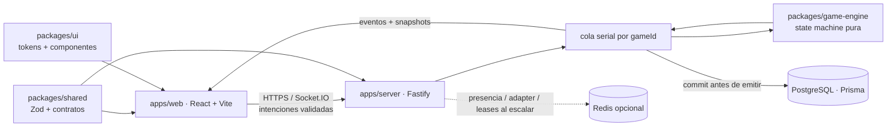

# ATLAS ESTATES

Juego web multijugador de economía y propiedades con identidad original. De 2 a 8 jugadores recorren el mundo, compran ciudades, negocian activos y sobreviven a una economía dinámica. El navegador presenta el juego; el servidor es la única autoridad sobre turnos, azar, movimiento, dinero y propiedad.

> Estado actual: **primer MVP multijugador funcional en entorno local**. Dos clientes independientes pueden crear/unirse, preparar e iniciar una partida, jugar turnos autoritativos, comprar y negociar propiedades, hipotecar, subastar, chatear y reconectarse. Los turnos, subastas y ofertas sin respuesta se resuelven de forma segura al vencer su temporizador. El despliegue público y las fases avanzadas siguen pendientes; consulta [PLAN.md](./PLAN.md) para ver el alcance verificable.

El cliente incluye audio procedural original: ambiente musical y efectos para dados, movimiento, compras, alquileres, dinero, eventos, notificaciones, trades, bancarrota y victoria. El botón de altavoz abre controles persistentes de volumen general, música, efectos y mute.

## Principios del producto

- Propiedad intelectual original: no se reutilizan código, marcas, tableros, textos ni assets de RichUp o Monopoly.
- Servidor autoritativo: el cliente envía intenciones, nunca resultados económicos ni de movimiento.
- Engine independiente: reglas puras y testeables, sin React, Socket.IO, Prisma ni reloj global.
- Persistencia recuperable: eventos duraderos, snapshots y reconexión por sesión.
- Contenido dirigido por datos: mapas, casillas y cartas se registran mediante contratos versionados.
- Accesibilidad y rendimiento: desktop-first con experiencia móvil específica, objetivos WCAG 2.2 AA y animación fluida con reducción de movimiento.

## Arquitectura



La decisión técnica completa, los límites entre módulos y el modelo de escalado están en [docs/architecture.md](./docs/architecture.md). La máquina de estados está en [docs/game-engine.md](./docs/game-engine.md), y el protocolo realtime en [docs/realtime-protocol.md](./docs/realtime-protocol.md).

## Monorepo implementado

```text
apps/
  web/                 React, Vite, Tailwind, Zustand, Framer Motion
  server/              Fastify, Socket.IO, autenticación y orquestación
packages/
  database/            Prisma schema, cliente y migraciones
  game-engine/         estado, comandos, reducers, economía y contenido
  shared/              contratos Zod y tipos compartidos
  ui/                   design tokens y UI reutilizable
  e2e/                  prueba Playwright de dos contextos y reconexión
docs/                   decisiones de producto y operación
```

Los nombres bajo `apps/*` y `packages/*` son workspaces pnpm. El checklist de [PLAN.md](./PLAN.md) distingue lo implementado de las fases avanzadas todavía pendientes.

## Requisitos locales

- Node.js 22 o posterior
- pnpm 11 o posterior, directamente o mediante el Corepack incluido con Node.js
- Docker Desktop, o una instancia PostgreSQL 16 accesible
- Redis 7 es opcional en desarrollo y necesario solo para las funciones de escalado que lo utilicen

## Inicio rápido en Windows

Desde cualquier PowerShell, incluso si `pnpm` no está en `PATH`:

```powershell
& 'C:\Users\jamie\Documents\Richup\start-local.cmd'
```

El arrancador localiza el workspace, usa `pnpm` o `corepack pnpm`, instala dependencias, genera Prisma Client y abre web/API con persistencia efímera. Para preparar sin iniciar los servidores usa `-NoDev`; para omitir una instalación ya realizada usa `-SkipInstall`.

La forma manual equivalente es:

```powershell
Set-Location 'C:\Users\jamie\Documents\Richup'
corepack pnpm install
corepack pnpm db:generate
$env:DATABASE_DISABLED = 'true'
corepack pnpm dev
```

Los comandos deben ejecutarse desde el workspace, no desde `C:\Users\jamie`.

## Instalación

```bash
pnpm install
cp .env.example .env
docker compose up -d postgres redis
pnpm db:generate
pnpm db:migrate
pnpm dev
```

En PowerShell, usa `Copy-Item .env.example .env` en lugar de `cp`. Con los puertos por defecto, el cliente se sirve en `http://localhost:5173`, la API/realtime en `http://localhost:3001`, PostgreSQL en `localhost:5432` y Redis en `localhost:6379`.

No copies secretos reales al repositorio. Para detener la infraestructura local sin borrar datos: `docker compose stop`. `docker compose down -v` elimina los volúmenes locales y, por tanto, sus datos.

## Variables de entorno

| Variable                 | Proceso         | Uso                                                          |
| ------------------------ | --------------- | ------------------------------------------------------------ |
| `NODE_ENV`               | server          | `development`, `test` o `production`                         |
| `CORS_ORIGINS`           | server          | orígenes permitidos, separados por comas                     |
| `VITE_SERVER_URL`        | web             | URL pública HTTP/Socket.IO del backend                       |
| `PORT`                   | server          | puerto de escucha local                                      |
| `DATABASE_URL`           | server/database | conexión PostgreSQL usada por Prisma                         |
| `DATABASE_DISABLED`      | server          | `true` activa el modo efímero local explícito                |
| `DATABASE_REQUIRED`      | server          | exige persistencia; producción la activa si la DB está on    |
| `SESSION_SECRET`         | server          | firma de sesiones; mínimo 32 caracteres aleatorios           |
| `SNAPSHOT_EVERY_ACTIONS` | server          | frecuencia de snapshots por número de acciones               |
| `RECONNECT_TTL_MS`       | server          | vigencia de un token opaco de reconexión                     |
| `DISCONNECT_GRACE_MS`    | server          | espera antes de migrar host tras una desconexión             |
| `LOG_LEVEL`              | server          | nivel de logs de Fastify                                     |
| `REDIS_URL`              | server          | reservado para el adapter distribuido de la fase de escalado |

Producción debe proporcionar secretos mediante el panel del proveedor y exigir TLS. En despliegues separados, `CORS_ORIGINS` incluye la URL web pública y `VITE_SERVER_URL` apunta a la URL HTTPS pública del servidor.

## Desarrollo

```bash
pnpm dev              # todos los workspaces persistentes
pnpm dev:web          # solo cliente
pnpm dev:server       # solo servidor
pnpm db:studio        # inspección local de Prisma
```

El flujo autoritativo es siempre:

1. El cliente crea un `commandId` y envía una intención con la versión que conoce.
2. El servidor autentica, valida el payload y encola el comando por `gameId`.
3. El engine comprueba estado, turno, permisos y precondiciones, y produce eventos.
4. El servidor persiste los eventos y transacciones en una operación atómica.
5. Solo después del commit publica el resultado ordenado a la room.
6. Un cliente con huecos de secuencia solicita `game:resync` y recibe eventos o snapshot.

## Game engine

`@circuit/game-engine` se diseña como una función determinista: `state + command + context -> state + domainEvents`. El contexto inyecta reloj e RNG; las pruebas pueden reproducir exactamente una partida. Ningún componente React modifica saldo, dueño, posición, tirada o fase.

Los estados canónicos son `LOBBY`, `STARTING`, `TURN_START`, `ROLLING`, `MOVING`, `LANDING`, `PROPERTY_DECISION`, `PAYMENT`, `CARD_EVENT`, `TRADE`, `AUCTION`, `JAIL`, `TURN_END` y `GAME_OVER`. Las transiciones y sus invariantes están descritas en [docs/game-engine.md](./docs/game-engine.md).

## Realtime, reconexión y persistencia

Socket.IO transporta contratos Zod versionados desde `@circuit/shared`. Los mensajes del servidor llevan una secuencia monotónica por partida. `commandId` hace idempotentes los reintentos; `expectedVersion` detecta clientes obsoletos. Tras perder conexión, una sesión vuelve a vincularse al mismo `GamePlayer`, recibe un snapshot y reproduce eventos posteriores.

La implementación no depende del socket para conservar estado: `GameEvent` es el registro duradero, `GameSnapshot` acelera la recuperación y `Transaction` mantiene la auditoría económica. Consulta [docs/reliability-security.md](./docs/reliability-security.md).

## Añadir contenido

- [Añadir un mapa](./docs/content-extension.md#añadir-un-mapa): crear un `MapConfig` versionado, validar su grafo, economía y contenido, y registrarlo.
- [Añadir una carta](./docs/content-extension.md#añadir-una-carta-o-evento): declarar condiciones y efectos de dominio sin callbacks arbitrarios.
- [Añadir un tipo de casilla](./docs/content-extension.md#añadir-un-tipo-de-casilla): ampliar el discriminante, schema, handler exhaustivo y tests.

Nunca se debe introducir lógica de contenido dentro de un componente de tablero. Las ilustraciones y el audio son referencias por ID; no alteran reglas.

## Calidad y tests

```bash
pnpm format:check
pnpm lint
pnpm typecheck
pnpm test
pnpm build
pnpm test:e2e
```

Una fase no se marca completa hasta superar build, lint, TypeScript y su batería de tests. La suite Playwright automatiza dos contextos independientes para crear/unirse, ready/start, sincronizar una tirada y reconectar. La matriz ampliada de compra, evento, trade, subasta e hipoteca también se verificó manualmente en navegador; bancarrota y victoria permanecen cubiertas en el engine hasta completar su E2E dirigido.

## Despliegue

- Web: Vercel, con `apps/web` como root o filtro de monorepo.
- Server: Railway, Render o Fly.io como proceso Node persistente con soporte WebSocket.
- Datos: PostgreSQL gestionado con backups y point-in-time recovery.
- Escala horizontal: Redis gestionado, Socket.IO Redis adapter y propiedad/lease explícito por partida.

El backend no se despliega como funciones serverless de corta duración: mantiene conexiones WebSocket y timers autoritativos. La guía de build, migración, health checks, CORS y rollout está en [docs/deployment.md](./docs/deployment.md).

## Documentación

- [Requisitos y alcance](./docs/requirements.md)
- [Arquitectura técnica](./docs/architecture.md)
- [Game engine y state machine](./docs/game-engine.md)
- [Protocolo WebSocket](./docs/realtime-protocol.md)
- [Modelo de datos](./docs/data-model.md)
- [Concurrencia, reconexión y seguridad](./docs/reliability-security.md)
- [Sistema visual y concept art](./docs/visual-system.md)
- [Mapas, cartas y casillas](./docs/content-extension.md)
- [Testing](./docs/testing.md)
- [Despliegue](./docs/deployment.md)

## Licencia y assets

El nombre, mundo, reglas específicas, textos y assets de ATLAS ESTATES deben ser originales o contar con una licencia compatible documentada. Los concept arts son dirección visual, no capturas que deban rasterizarse como interfaz: HUD, texto, botones, formularios y modales se implementan como HTML/React accesible.
