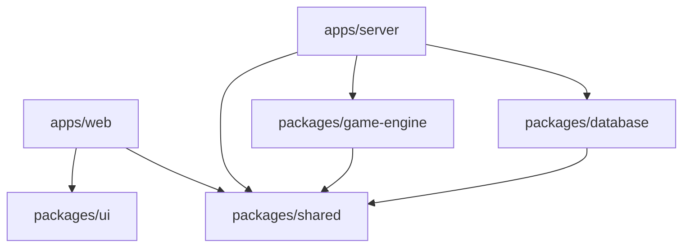
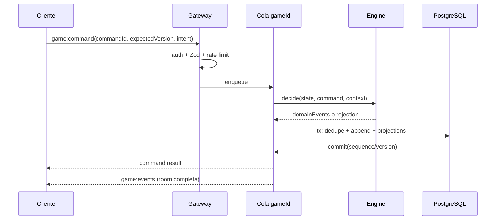

# Arquitectura técnica

## Decisión de stack

- **Web:** React + TypeScript + Vite, Tailwind CSS, Framer Motion y Zustand. Vite reduce superficie de servidor y encaja con una SPA realtime; las páginas públicas no justifican introducir Next.js en el MVP.
- **Server:** Node.js 22, TypeScript, Fastify y Socket.IO. Fastify aloja health/auth/rooms y Socket.IO comparte autenticación, validación y servicios de aplicación.
- **Datos:** PostgreSQL + Prisma. PostgreSQL contiene identidad, configuración y el registro recuperable de la partida.
- **Contratos:** Zod en `@circuit/shared`; los tipos se infieren del schema, no se duplican a mano.
- **Tests:** Vitest para unit/integration y Playwright para dos contextos de navegador.
- **Infra local:** Docker Compose con PostgreSQL 16 y Redis 7.

## Regla de dependencias



`game-engine` no importa server, web, Prisma, Socket.IO, DOM ni UI. `shared` no importa aplicaciones. `database` traduce filas a objetos de dominio persistibles, pero no decide reglas. Cualquier ciclo entre packages es un defecto arquitectónico.

## Estructura objetivo y responsabilidades

```text
apps/
  web/src/
    app/                 bootstrap, router y providers
    features/            home, rooms, lobby, game, profile
    game/                board renderer, HUD, animation queue
    realtime/            socket client, resync y selectors
    stores/              estado de vista, nunca autoridad económica
  server/src/
    auth/                guest/account/session/reconnect
    http/                health, auth y endpoints de consulta
    realtime/            handshake, rooms Socket.IO y ACKs
    rooms/               lifecycle, quick play y host migration
    games/               registry, ownership y command queues
    persistence/         event store, snapshots y restore
    security/            schemas, rate limits, chat sanitization
packages/
  game-engine/src/
    model/               GameState y value objects
    commands/            schemas de intención
    events/              eventos de dominio
    machine/             transición y reducers exhaustivos
    economy/             ledger, rentas, activos y deuda
    content/             mapas, tiles y cartas
    policies/            victory, AFK, bots y reglas configurables
  database/prisma/       schema y migraciones
  shared/src/            envelopes, schemas, IDs y errores públicos
  ui/src/                tokens y componentes presentacionales
```

## Componentes de runtime

| Componente       | Mantiene                                                  | No debe hacer                         |
| ---------------- | --------------------------------------------------------- | ------------------------------------- |
| Web              | snapshot confirmado, cola visual, preferencias, drafts UI | calcular resultados ni avanzar fase   |
| Gateway realtime | autenticación, validación, rate limit, ACK                | mutar `GameState` directamente        |
| Room service     | members, host, ready, settings pre-game                   | aplicar reglas de tablero             |
| Game registry    | instancia activa/owner, carga y descarte                  | ser única fuente duradera             |
| Command queue    | orden total por `gameId`                                  | ordenar partidas diferentes entre sí  |
| Engine           | validar y producir eventos deterministas                  | I/O, timers globales o broadcast      |
| Event store      | secuencia, idempotencia y transacción                     | interpretar reglas                    |
| Projector        | snapshots, ledger, results y read models                  | aceptar datos del cliente como verdad |

## Camino de un comando



Un fallo antes del commit no emite éxito. Un fallo después del commit puede impedir el broadcast, pero el cliente recupera el evento por secuencia al reconectar. Esta regla evita estados confirmados solo en memoria.

## Estado activo y ciclo de vida

1. Al crear/iniciar, el server carga el último `GameSnapshot` válido y aplica `GameEvent` posteriores.
2. Una partida activa reside en una instancia bajo un único owner lógico.
3. Cada comando pasa por una cola FIFO por `gameId`; diferentes partidas avanzan en paralelo.
4. Después del commit se actualiza la copia en memoria y se emiten eventos.
5. Se crea snapshot por número de eventos o tiempo, siempre con `lastSequence`.
6. Sin conexiones, la partida puede hibernar después de persistir; un deadline futuro se registra y reprograma al restaurar.

## Timers

El estado guarda `deadlineAt`, no “segundos restantes”. El servidor agenda un wake-up que encola un comando interno `SYSTEM_TIMEOUT`. Al restaurar, si el deadline ya venció, se encola inmediatamente. El cliente calcula la cuenta atrás visual con el tiempo de servidor recibido, pero el server decide si una acción llegó a tiempo, aplicando `TURN_TIMER_GRACE_MS` de forma consistente.

## Escalado

### Etapa 1: una réplica

Una réplica Node mantiene sockets, colas y timers. PostgreSQL persiste; Redis puede quedar desactivado. Es la topología más segura para validar el MVP.

### Etapa 2: varias réplicas

El Redis adapter difunde packets, pero **no resuelve por sí solo la concurrencia**. Antes de añadir réplicas se necesita:

- sticky session o transport compatible para el handshake;
- lease con fencing token por `gameId`, TTL y renovación;
- routing del comando al owner o una cola duradera particionada;
- versión optimista en PostgreSQL como defensa final;
- recuperación de timers al cambiar owner;
- métricas de lease conflict, queue depth y command latency.

Una réplica sin lease jamás debe ejecutar comandos de una partida que posee otra.

## Separación write/read

- El write model es `GameState` reconstruible y sus eventos.
- Las pantallas de rooms, perfiles, leaderboard e historial leen proyecciones Prisma.
- El feed de actividad deriva de eventos con templates localizables, no de strings guardadas como única verdad.
- `Transaction` es una proyección auditada del evento económico e incluye referencias que permiten rastrear el comando.

## Decisiones que deben permanecer explícitas

| Decisión                     | Motivo                                             | Momento de revisar                                 |
| ---------------------------- | -------------------------------------------------- | -------------------------------------------------- |
| Vite SPA en lugar de Next.js | loop realtime sin necesidad de SSR                 | si SEO/contenido público se convierte en prioridad |
| Una réplica inicial          | preserva orden simple y reduce fallos distribuidos | al medir saturación, no por anticipación           |
| Event log + snapshots        | recovery y auditoría                               | no retirar; ajustar frecuencia/retención           |
| Zod como contrato fuente     | runtime validation compartida                      | si se adopta generación formal de protocolo        |
| Mapas como grafo             | soporta círculo, hexágono y bifurcaciones          | mantener, incluso si el primer mapa es un circuito |
