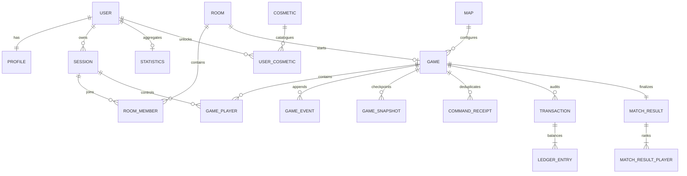

# Modelo de datos PostgreSQL / Prisma

## Criterio de modelado

Los datos consultables y con integridad relacional se normalizan. El estado activo complejo se conserva como eventos y snapshots JSON versionados, porque intentar normalizar cada efecto temporal haría el replay frágil. PostgreSQL es la fuente duradera; Redis solo acelera presencia/coordinación.

IDs públicos usan UUID/CUID opacos. Dinero usa `BigInt` o entero dentro del rango verificado, siempre en unidades menores y nunca `Float`. Fechas se guardan en UTC. Los enums persistidos deben evolucionar mediante migraciones compatibles.

## Inventario implementado en Phase 1

La fuente de verdad es `packages/database/prisma/schema.prisma`. El scaffold actual contiene:

- identidad: `User`, `Profile`, `UserSession`;
- rooms: `Room`, `RoomMember`;
- contenido: `MapDefinition`;
- partida: `Game`, `GamePlayer`, `GameEvent`, `GameSnapshot`, `Transaction`;
- resultado: `MatchResult`, `MatchResultPlayer`, `UserStatistics`;
- social/cosméticos/moderación: `Friendship`, `RecentPlayer`, `Cosmetic`, `UserCosmetic`, `Report`.

Los nombres conceptuales `Session`, `Map` y `Statistics` usados en diagramas corresponden a `UserSession`, `MapDefinition` y `UserStatistics`. `AuthAccount`, `CommandReceipt`, `LedgerEntry` y `ChatMessage` son endurecimientos propuestos, no modelos implementados todavía. Antes del gate de persistencia se debe decidir si se incorporan o si su garantía se resuelve con constraints equivalentes en los modelos existentes.

Las secciones siguientes describen el modelo objetivo endurecido. El schema inicial usa `Room.hostUserId` + `RoomMember.isHost` en lugar de `hostMemberId`, `Room.version` en lugar de `settingsRevision`, `Game.currentRevision` en lugar de `currentVersion`, y `GameSnapshot.revision/eventSequence` en lugar de `lastSequence`. Esas diferencias deben migrarse o documentarse como equivalencias antes de tratar este diseño como implementado.

## Identidad

### `User`

Cuenta opcional: `id`, `emailNormalized` único nullable durante flujo controlado, `passwordHash` nullable para OAuth, `status`, `createdAt`, `updatedAt`, `lastSeenAt`. Nunca se guarda password en claro.

### `Profile`

Relación 1:1 con User: `userId`, `username`, `usernameNormalized` único, `avatarId`, `level`, `xp`, preferencias públicas y timestamps. Estadísticas acumuladas se relacionan, no se aceptan como input de cliente.

### `AuthAccount` (propuesto) y `UserSession`

`AuthAccount` prepara proveedores OAuth (`provider`, `providerAccountId`, `userId`) sin hacer OAuth requisito del MVP. `Session` admite guest o usuario registrado: hash de token, expiración, revocación, rotación, metadata mínima de seguridad. Un guest obtiene un `sessionId` durable y puede vincularse a User más tarde.

No almacenar tokens de sesión o reconexión en claro: se presenta el secreto una vez y se persiste su hash.

## Rooms y partidas

### `Room`

- `id`, `code` único e insensible a mayúsculas, `name`;
- `access` (`PUBLIC`, `PRIVATE`), `passwordHash` nullable;
- `hostMemberId`, `status`, `maxPlayers`, `allowSpectators`;
- `mapId`, `mapVersion`, `mode`, `settingsJson`, `settingsRevision`;
- `createdAt`, `updatedAt`, `expiresAt`.

`code` lo genera el servidor con alfabeto no ambiguo y reintento ante colisión. Room password se hashea con Argon2id/bcrypt; no se confunde con auth de cuenta.

### `RoomMember`

`id`, `roomId`, `sessionId`, `userId?`, `role`, `seat`, `nicknameSnapshot`, personalización elegida, `ready`, `connectionStatus`, timestamps. Constraints: una sesión una vez por room, seat único donde aplique y host referenciando un member válido.

### `Game`

`id`, `roomId?`, `status`, `engineVersion`, `mapId`, `mapVersion`, `rulesVersion`, `settingsJson`, `currentVersion`, `lastSequence`, `startedAt`, `endedAt`, `nextDeadlineAt`, `winnerGamePlayerId?`, `resultFinalizedAt?`.

`currentVersion` se actualiza con compare-and-swap en persistencia como defensa de concurrencia. `nextDeadlineAt` permite recuperar timers sin inspeccionar todo el snapshot.

### `GamePlayer`

Identidad inmutable dentro de una partida: `id`, `gameId`, `sessionId`, `userId?`, `seat`, `nicknameSnapshot`, avatar/color/token snapshots, `role`, `status`, `finalRank?`, `joinedAt`, `disconnectedAt?`, `eliminatedAt?`. No se usa socket ID. Constraints únicos: `(gameId, seat)` y `(gameId, sessionId)`.

## Event store y recuperación

### `GameEvent`

`id`, `gameId`, `sequence`, `gameVersion`, `type`, `schemaVersion`, `actorGamePlayerId?`, `commandId?`, `payloadJson`, `occurredAt`, `persistedAt`, `correlationId`. Índices/constraints:

- unique `(gameId, sequence)`;
- index `(gameId, occurredAt)`;
- index `commandId` para trazabilidad;
- payload con tamaño máximo impuesto en aplicación.

Los eventos son append-only. Correcciones se expresan como nuevos eventos o migraciones controladas, nunca editando silenciosamente historia de una partida activa.

### `GameSnapshot`

`id`, `gameId`, `lastSequence`, `gameVersion`, `engineVersion`, `schemaVersion`, `stateJson` o estado comprimido, `checksum`, `createdAt`. Unique `(gameId, lastSequence)`. El restore elige el snapshot compatible más reciente con checksum válido y aplica eventos posteriores.

### `CommandReceipt` (propuesto)

`gameId`, `commandId`, hash del payload canónico, actor, status, versión/secuencias resultantes, error público si fue rechazo durable y timestamps. Unique `(gameId, commandId)`. Permite devolver el mismo resultado a un retry sin aplicar dos veces.

## Economía

### `Transaction`

Cabecera de operación económica: `id`, `gameId`, `eventId`, `commandId?`, `type`, `reason`, `amount`, `currency`, `fromGamePlayerId?`, `toGamePlayerId?`, `assetId?`, `metadataJson`, `createdAt`. Banco se representa como cuenta explícita o lado nullable según la implementación final, pero no como un player falso expuesto a clientes.

### `LedgerEntry` (propuesto)

Para auditoría de doble entrada: `id`, `transactionId`, `accountKey`, `direction` (`DEBIT`/`CREDIT`), `amount`. La suma por `transactionId` debe balancear. Una compra puede producir transferencia de efectivo y cambio de ownership como eventos separados correlacionados.

No se actualiza un saldo materializado desde una ruta distinta al projector económico. Si se mantiene saldo en snapshot para velocidad, el ledger sigue siendo la auditoría y tests comprueban su reconciliación.

## Resultados y progresión

### `MatchResult` y `MatchResultPlayer`

Resultado inmutable final: game, modo, mapa/version, victory condition, duración, rounds y una fila por participante con rank, outcome, cash, net worth, propiedades, rent earned, trades, biggest transaction y recap awards. Unique `gameId` evita otorgar XP dos veces.

### `Statistics`

Acumulado por User: games/wins/losses, totalMoneyEarned, biggestFortune, propertiesPurchased, bankruptcies y contadores de mapas. Se actualiza en la misma operación de finalización o mediante consumer idempotente con marcador de proyección.

Una tabla `Rating` futura almacena queue/mode, rating, deviation/volatility o MMR interno, season y tier visible. No se mezcla rating con nivel cosmético.

## Contenido y social

### `MapDefinition`

Registro de publicación: `id`, `slug`, `version`, `name`, `theme`, `status`, `configJson`, `checksum`, `createdAt`, `publishedAt?`, `authorUserId?`. Unique `(slug, version)`. Partidas apuntan a una versión inmutable; editar crea nueva versión.

### `Cosmetic` y `UserCosmetic`

Catálogo (`type`, `rarity`, asset references, active) y ownership (`userId`, `cosmeticId`, `unlockedAt`, `source`). Unique `(userId, cosmeticId)`. Equipar un cosmético no concede ventajas de reglas.

### `Friend` / `FriendRequest`

Una relación canónica por par ordenado de usuarios evita duplicados inversos. Requests tienen sender, receiver, status y timestamps. Invitaciones a room son objetos efímeros o persistidos con expiración y nunca saltan access control.

### `ChatMessage` (propuesto) y `Report`

Chat opcionalmente persistido con room/game scope, actor, texto ya normalizado, tipo quick-message y moderation flags/retention. `Report` relaciona reporter, target/message/game, category, details limitados, status y reviewer metadata. No incluir secretos de sesión en evidencia.

## Relaciones resumidas

## Transacción de escritura de juego

Dentro de una transacción Prisma/PostgreSQL:

1. adquirir/validar versión actual y command receipt;
2. rechazar payload conflictivo o devolver receipt existente;
3. insertar `GameEvent` con secuencias contiguas;
4. insertar `Transaction`/`LedgerEntry` derivadas;
5. actualizar `Game.currentVersion`, `lastSequence` y deadline con condición de versión;
6. insertar `CommandReceipt` final;
7. opcionalmente persistir snapshot/proyección si toca.

Solo después del commit se actualiza memoria y se emite. Un unique violation o compare-and-swap fallido provoca reload/retry controlado, nunca merge improvisado.

## Índices mínimos a comprobar con datos reales

- rooms públicas por `(status, access, updatedAt)` y code único;
- games activas por `(status, nextDeadlineAt)`;
- events/snapshots por `(gameId, sequence desc)`;
- session token hash único y `(expiresAt, revokedAt)` para limpieza;
- profile username/email normalizados únicos;
- match history por `(userId, endedAt desc)` a través de participant/result;
- reports por `(status, createdAt)`.

Los índices se validan con `EXPLAIN ANALYZE`; no se crean índices especulativos sobre cada columna JSON.
