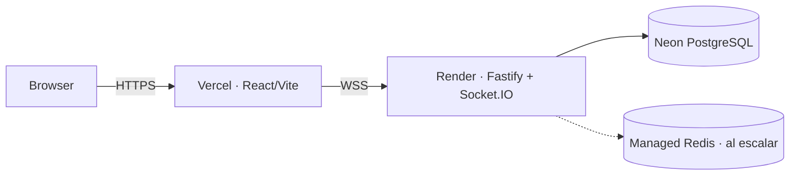

# Despliegue y operación

## Topología de producción preparada



El backend requiere un proceso Node persistente y soporte WebSocket; no se despliega como Vercel Functions. `VITE_SERVER_URL` enlaza el cliente con Render. `SERVE_WEB=true` conserva un fallback unificado, pero Neon sigue siendo obligatorio y las partidas ya no dependen de la RAM para sobrevivir un reinicio.

El repositorio incluye `Dockerfile`, `render.yaml`, `vercel.json` y CI. Render usa `/ready`, ejecuta migraciones antes del servidor y no arranca si falta PostgreSQL. Mantener una sola réplica evita split-brain hasta implementar leases distribuidos.

## Local con Docker Compose

`docker-compose.yml` levanta PostgreSQL 16 y Redis 7 con health checks y volúmenes persistentes:

```bash
docker compose up -d postgres redis
docker compose ps
pnpm db:generate
pnpm db:migrate
pnpm dev
```

La app se ejecuta en host durante desarrollo. Por eso `.env.example` usa `localhost`. Si más adelante server se ejecuta dentro de Compose, su `DATABASE_URL` debe usar hostname `postgres` y `REDIS_URL=redis://redis:6379`.

## Variables por entorno

### Web separada (opcional)

- `VITE_SERVER_URL=https://api.example.com`

Variables `VITE_*` quedan embebidas en el bundle y jamás contienen secretos. Configurar SPA fallback si el router usa history API y restringir source maps públicos según política.

### Servicio unificado

- `NODE_ENV=production`
- `PORT` proporcionado por la plataforma
- `SERVE_WEB=true`
- `WEB_DIST_PATH=apps/web/dist`
- `CORS_ORIGINS=https://<proyecto>.vercel.app` (allowlist exacta)
- `DATABASE_DISABLED=false`
- `DATABASE_REQUIRED=true`
- `DATABASE_URL` con TLS según proveedor
- `SESSION_SECRET` aleatorio y rotado mediante plan compatible
- `SNAPSHOT_EVERY_ACTIONS` y temporizadores validados
- `REDIS_URL` solo cuando las funciones distribuidas estén implementadas

No copiar `.env` local al proveedor. Usar su secret manager y limitar quién puede leer producción.

## Build y start

El contenedor ejecuta estos pasos:

```bash
pnpm install --frozen-lockfile
pnpm build
pnpm --filter @circuit/database migrate:deploy
node apps/server/dist/src/index.js
```

El servidor escucha en `0.0.0.0:$PORT`. Render construye desde `Dockerfile`; no hace falta configurar comandos manuales al usar `render.yaml`.

## Enlace público temporal

Con el build ya generado y el servidor unificado escuchando en el puerto `4100`:

```powershell
$env:NODE_ENV = 'production'
$env:PORT = '4100'
$env:SERVE_WEB = 'true'
$env:DATABASE_DISABLED = 'true'
$env:CORS_ORIGINS = '*'
node apps/server/dist/src/index.js
```

En otra terminal:

```powershell
cloudflared tunnel --url http://localhost:4100
```

La URL aleatoria `https://….trycloudflare.com` permite probar WebSockets desde redes distintas. Es un túnel de desarrollo sin SLA: el proceso local y el PC deben seguir encendidos.

## Migraciones

1. backup/PITR disponible y restore probado;
2. ejecutar migración compatible hacia adelante una sola vez como release job;
3. desplegar código que soporte schema viejo/nuevo durante rollout;
4. retirar columnas o enums solo en una release posterior;
5. ejecutar smoke de health, auth, room, snapshot y command;
6. registrar versión de migración junto al deploy.

No ejecutar `prisma migrate dev` en producción ni migración destructiva automáticamente en cada réplica.

## Health y readiness

- `/health/live`: proceso/event loop responde; no consulta todas las dependencias.
- `/health/ready`: DB disponible, migración esperada y restore/ownership listo para aceptar tráfico.
- Métricas separadas para Redis: si es opcional, su fallo no debe fingir readiness distribuido; o se desactiva escala, o se marca no-ready según modo.

El health endpoint no expone versión de dependencias, URL de DB, stack ni secretos.

## WebSocket, proxy y CORS

- Habilitar upgrade WebSocket y timeouts mayores que heartbeat.
- HTTPS/WSS en el borde; cookies `Secure`.
- `WEB_ORIGIN` allowlist exacta y credenciales configuradas coherentemente.
- Si web y API usan subdominios, fijar estrategia de cookie/CSRF antes del launch.
- En varias réplicas, configurar sticky sessions según transporte/adaptador y probar reconnect entre réplicas.

## PostgreSQL gestionado

Requisitos mínimos: TLS, backups automáticos, point-in-time recovery, métricas, pool de conexiones y restore ensayado. Elegir región próxima al server, no solo al usuario. Prisma usa pool acotado por réplica para no agotar conexiones durante autoscaling.

Retención: eventos/snapshots de partidas activas nunca se purgan; tras finalización se define política legal/producto y se conserva el resultado/ledger necesario. Cleanup es un job idempotente con métricas.

## Redis

No es fuente de verdad. Puede cubrir adapter Socket.IO, presence, rate limits, matchmaking efímero y ownership leases. Activar varias réplicas solo cuando el lease/fencing/routing por `gameId` esté implementado y probado; simplemente añadir Redis adapter no protege compras simultáneas.

## Rollout seguro

1. correr format, lint, typecheck, unit/integration/build/E2E;
2. aplicar migración compatible;
3. desplegar server canary/una réplica;
4. comprobar restore de partidas activas y command latency;
5. desplegar web compatible con versiones de protocolo soportadas;
6. smoke con dos clientes reales;
7. ampliar tráfico y vigilar errores/reconnect/snapshot age;
8. rollback de código si falla, sin revertir schema destructivamente.

Partidas activas fijan engine/map/rules version. Un deploy debe mantener compatibilidad o drenar partidas antes de retirar código antiguo.

## Observabilidad

Dashboard mínimo:

- sockets/connections/reconnect success;
- rooms y partidas por fase/versión;
- commands accepted/rejected/duplicate/stale;
- queue depth y tiempo de espera por game;
- engine/DB/broadcast p50/p95;
- event sequence conflicts y lease conflicts;
- snapshot age, restore duration/failures;
- PostgreSQL pool/CPU/storage y Redis latency;
- server crashes, event loop lag y memory.

Logs estructurados usan correlation IDs y redaction. Alertas enlazan a un runbook con: impacto, consultas seguras, drain, restore, rollback y responsable.

## Backups y disaster recovery

- Definir RPO/RTO antes de producción y verificar que el plan contratado los cumple.
- Probar restore en entorno aislado, no asumir que “backup enabled” basta.
- Verificar checksum/replay de una muestra de partidas restauradas.
- Guardar migraciones y config versionada junto al release.
- Rotar secretos tras incidente y revocar sessions/reconnect tokens afectados.

## Checklist de lanzamiento

- [ ] Dominio, TLS, CORS y cookies validados desde navegador real.
- [ ] Secretos solo en proveedor; `.env.example` sin valores sensibles.
- [ ] Migración release-safe y rollback documentado.
- [ ] Health/readiness correctos y graceful shutdown probado.
- [ ] Backups/PITR y restore ensayados.
- [ ] Dos equipos completan flujo MVP público y reconnect.
- [ ] Logs/metrics/alerts y redaction revisados.
- [ ] Asset inventory/licencias y política de privacidad/moderación aprobados.
- [ ] Escala horizontal desactivada hasta validar ownership/leases.
