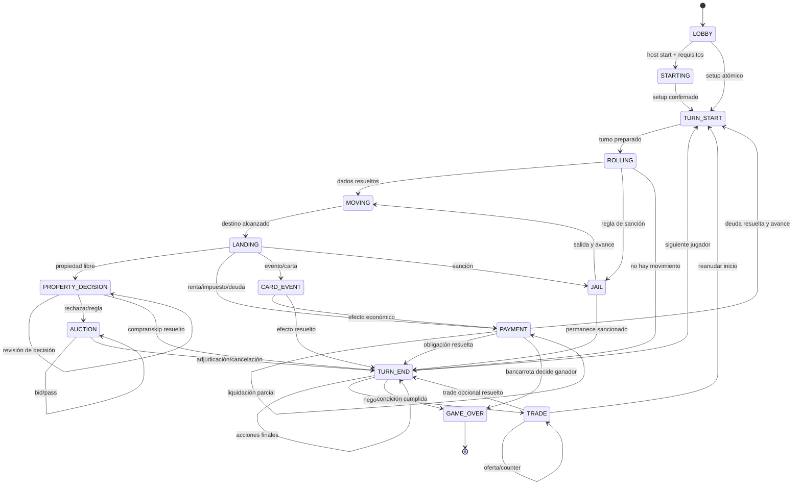

# Game engine autoritativo

## Contrato principal

El engine es una librería pura. Recibe estado confirmado, un comando autenticado y dependencias deterministas; devuelve rechazo o eventos. No escribe en base de datos y no conoce sockets.

```ts
type Decide = (
  state: GameState,
  command: GameCommand,
  context: { now: number; rng: DeterministicRng }
) => { ok: true; events: DomainEvent[] } | { ok: false; error: DomainError };

type Evolve = (state: GameState, event: DomainEvent) => GameState;
```

Todos los eventos emitidos por `decide` se aplican con `evolve` para obtener el siguiente estado. El server asigna `sequence`, persiste y solo entonces publica.

## Modelo de estado

`GameState` contiene, como mínimo:

- identidad, versión del engine/config y secuencia aplicada;
- `phase`, ronda, orden, `activePlayerId` y deadline;
- grafo del mapa, posiciones y elección de path pendiente;
- efectivo, ownership, mejoras, hipotecas, inventario y efectos;
- decisión pendiente (propiedad, carta, deuda, jail/sanción);
- auction/trade activo y sus revisiones;
- PRNG state/counter o resultados de azar materializados como eventos;
- participantes, conexión/AFK, eliminated/spectator;
- condición de victoria y resultado si terminó.

No contiene objetos de UI, socket IDs, callbacks, componentes ni instancias Prisma.

## State machine



`TRADE` puede actuar como fase interrumpida: el estado guarda `resumePhase` y una razón. La implementación inicial permite volver a `TURN_START` o `TURN_END`; cualquier negociación durante liquidación que necesite volver a `PAYMENT` requiere ampliar explícitamente `ALLOWED_PHASE_TRANSITIONS`. No se “salta” de vuelta basándose en la UI.

## Tabla de autoridad por fase

| Fase                | Comandos de jugador aceptados      | Salida normal                           | Timeout seguro                     |
| ------------------- | ---------------------------------- | --------------------------------------- | ---------------------------------- |
| `LOBBY`             | ready, settings, start             | `STARTING`                              | ninguna                            |
| `STARTING`          | ninguno                            | `TURN_START`                            | cancelar si setup falla            |
| `TURN_START`        | acciones pre-roll permitidas       | `ROLLING`                               | preparar roll                      |
| `ROLLING`           | roll                               | `MOVING`                                | auto-roll                          |
| `MOVING`            | elegir path si existe              | `LANDING`                               | path válido por política           |
| `LANDING`           | ninguno                            | depende de tile                         | resolver automáticamente           |
| `PROPERTY_DECISION` | buy, auction, skip permitido       | `PROPERTY_DECISION/AUCTION/TURN_END`    | auction o skip según reglas        |
| `PAYMENT`           | liquidar, hipotecar, vender, trade | `PAYMENT/TURN_START/TURN_END/GAME_OVER` | política de liquidación/bancarrota |
| `CARD_EVENT`        | selección/ack si procede           | depende del efecto                      | selección segura                   |
| `TRADE`             | offer, counter, accept, decline    | `resumePhase`                           | expire/decline                     |
| `AUCTION`           | bid, pass                          | `TURN_END`                              | cerrar al deadline                 |
| `JAIL`              | pagar/usar carta/roll permitido    | `MOVING/TURN_END`                       | política configurada               |
| `TURN_END`          | acciones post-turn permitidas      | `TURN_START/GAME_OVER`                  | finalizar                          |
| `GAME_OVER`         | ninguno de juego                   | final                                   | ninguna                            |

## Comandos e idempotencia

Un comando representa intención: `ROLL_DICE`, `BUY_PROPERTY`, `BID_AUCTION`, `PASS_AUCTION`, `OFFER_TRADE`, `ACCEPT_TRADE`, `MORTGAGE_PROPERTY`, `END_TURN`. La identidad del actor viene de la sesión del server, no de un actor confiado desde el payload externo. El envelope usa `actionId` único y `expectedVersion`; el gateway los traduce a la revisión del engine. No se incluyen valores calculados como renta final o nuevo saldo.

El engine rechaza con códigos estables: `INVALID_ACTION`, `INVALID_PHASE`, `NOT_YOUR_TURN`, `STALE_REVISION`, `INSUFFICIENT_FUNDS`, `NOT_FOUND`, `NOT_OWNER` y `VALIDATION_FAILED`. El gateway los mapea al catálogo público (`STALE_STATE`, etc.); los textos son responsabilidad de la UI/localización.

## Eventos de dominio

Ejemplos: `TurnStarted`, `DiceRolled`, `TokenMoved`, `PathChoiceRequested`, `PropertyOffered`, `PropertyPurchased`, `RentCharged`, `MoneyTransferred`, `AuctionStarted`, `BidPlaced`, `AuctionClosed`, `TradeProposed`, `TradeAccepted`, `AssetMortgaged`, `DebtOpened`, `PlayerBankrupted`, `HostChanged`, `GameFinished`.

Un evento guarda hechos mínimos y suficientes para replay. `DiceRolled` guarda los resultados; el replay no vuelve a tirar. Un cambio monetario produce evento de dominio y una entrada de ledger/proyección con `reason`, origen/destino y correlación.

## Invariantes

- Una partida no tiene más de un `activePlayerId` ni más de una fase principal.
- `cash` usa unidades enteras; nunca floating point.
- Suma de débitos y créditos de una transferencia es cero, salvo banco explícito como contraparte.
- Una propiedad tiene cero o un dueño; una compra solo ocurre si sigue libre al ejecutar.
- Un jugador no vende/transfiere un asset que ya no posee o está bloqueado por otra operación.
- Ningún bid supera fondos disponibles reservando obligaciones previas según la regla.
- Aceptar trade revalida la revisión exacta, ownership y fondos de ambos lados en el mismo comando.
- `sequence` y `version` solo aumentan.
- Un jugador bankrupt no reaparece en el orden activo.
- `GAME_OVER` es terminal y su resultado se genera una sola vez.

## Economía y ledger

El Bank/Economy Service expone operaciones de dominio (`transfer`, `charge`, `award`, `purchase`, `mortgage`, `upgrade`) y evita asignaciones directas a saldos. Cantidades se expresan en minor units enteras. Cada operación incluye `transactionType`, `reason`, `fromAccount`, `toAccount`, `amount`, `commandId` y referencias de game/player/asset.

Cuando una obligación no puede pagarse, se abre `DebtState` con acreedor, cantidad y acciones permitidas. El saldo no se fuerza a negativo. Vender mejoras, hipotecar o cerrar un trade puede reducir la deuda; si expira sin resolver, la máquina declara bancarrota y transfiere activos según el acreedor.

## Azar inyectable

- El engine depende de `RandomSource`, por lo que las reglas no llaman a `Math.random()`.
- Producción usa `CryptoRandomSource` con `crypto.getRandomValues` y rejection sampling.
- Las pruebas usan `SequenceRandomSource` para resultados exactos y reproducibles.
- Tiradas/cartas resueltas se materializan en estado/eventos; un restore no vuelve a sortear el mismo comando.

Antes de ofrecer replay verificable o “provably fair”, se puede añadir un PRNG con algoritmo/version/seed counter fijados, guardar un compromiso hash previo y revelar la semilla al final. Ese mecanismo no está implementado en Phase 1 y no debe afirmarse como garantía actual.

## Mapas como grafos

`boardLayout` contiene nodos y edges dirigidos. Un circuito cuadrado es solo un grafo con una ruta; bifurcaciones crean varios edges salientes y solicitan elección. Cada nodo referencia un `tileId`; el render usa coordenadas/layout, mientras el movimiento usa conectividad. Validaciones de carga comprueban start único, IDs únicos, edges válidos, reachability y que no existan loops sin salida accidentales.

## Versionado y migración

Cada partida fija `engineVersion`, `mapVersion` y `rulesVersion`. Los snapshots incluyen esas versiones y checksum. Un deploy debe poder restaurar partidas activas de la versión anterior o drenarlas antes de retirar compatibilidad. Nunca se reinterpreta un event log histórico usando schemas incompatibles sin migración explícita.
